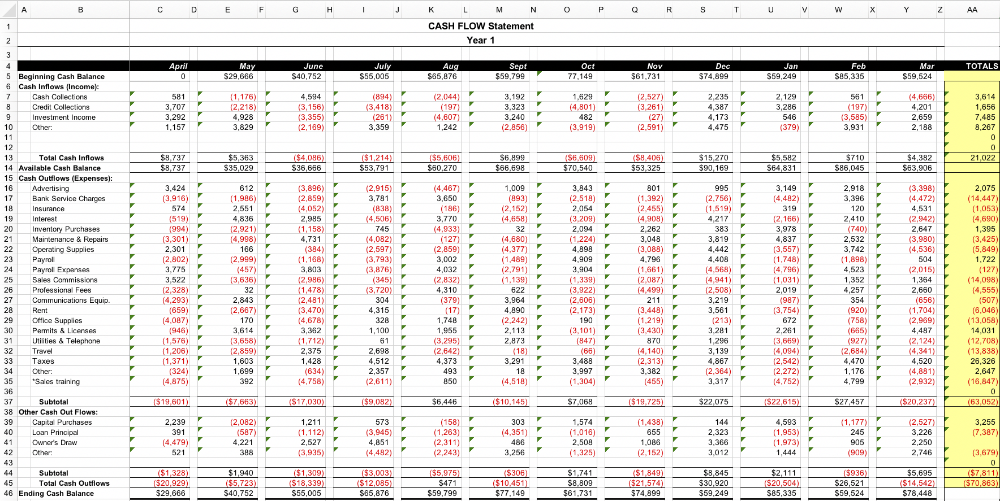
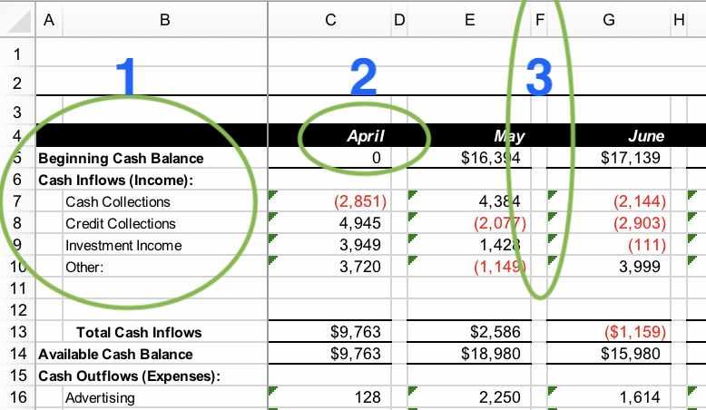
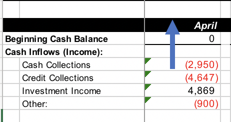
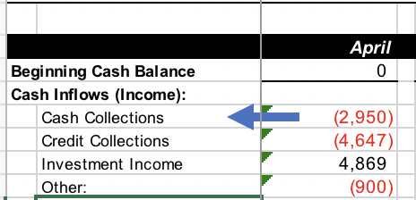
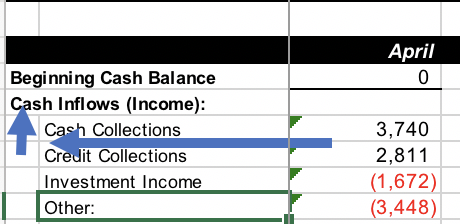

If you love using Excel, and it fits your 
needs, then by all means do your thing. However, there is also interest
out there for moving Excel analyses into R. If you are one of those people, 
and your Excel data is "messy," then this post is for you. We will be using
the `unpivotr` package to tidy up some Excel cash flow spreadsheets.

### The problem

Often, cash flow spreadsheets contain valuable info about a company's performance,
but they generally come in a non-tidy format. For R users, especially those who
use the [`tidyverse`](https://www.tidyverse.org/), this poses a real challenge, 
as most of our data analysis toolkit revolves around working with tidy data.

If you aren't familiar with "tidy" data, check out this [vignette](https://cran.r-project.org/web/packages/tidyr/vignettes/tidy-data.html). The
basic 3 tenants of tidy data are:

  1) Each variable forms a column.
  2) Each observation forms a row.
  3) Each type of observational unit forms a table.

Below is a typical cash flow statement for 1 year of performance, broken down
by month. This does not fit the "tidy" data standards, but is incredibly common
in the Financial world. Don't worry too much about how hard this is to see, I'll
zoom in on relevant features as we go along. But do notice how columns C through
Z are the months, and the left two columns represent main and sub-headers for
the cash flow sheet.

```{r cash flow sheet, echo=FALSE}

```

Why doesn't this fit the "tidy" principles? Here are just a few things we might change,
and a picture to highlight the problems.

```{r typical problems, echo=FALSE}

```

  1. `Cash Inflows (Income)` in column A is a "main header" with "sub-headers" in column B
  rows 7-13. This violates principle 2, because each row is not a standalone 
  observation. You need information from row 6 (the title of the category) to 
  figure out what category `Cash Collections` belongs in. Ideally, `Cash Inflows (Income)`
  would be repeated in column A, rows 7-10 and in row 13 to uniquely identify 
  that row.

  2. Row 4 identifies 13 columns in this dataset (12 months and a total column). In the 
  tidy world, this violates principle 1, because those 13 can actually be reduced to
  just 1 column, `month`, where we will just understand that `TOTALS` is the sum of 
  the others. Some people would even drop the `TOTALS` column, as it is easily
  computed from the 12 months of data and may cause confusion when looking at monthly
  totals.

  3. A general problem is that there are spaces in every other column. We can fix
  that easy enough.

  4. A last major problem is that some "main headers" actually contain data in 
  their rows, and some don't. For instance, row 5 has a main header of `Beginning Cash Balance` and also has data for each month. Compare that to `Cash Inflows (Income)` which
  instead has subcategories. We will deal with all this as we go through the tidying process.

### Following along

If you want to follow along, feel free to fork [this](https://github.com/DavisVaughan) 
Github repo which contains the data and the RMarkdown script.

The data comes from an Excel cash flow template I found and filled in with random
data just to test out.

### A tale of two packages

The main two packages that we need are [`readxl`](http://readxl.tidyverse.org/) to extract the data itself from the sheet, and [`unpivotr`](https://nacnudus.github.io/unpivotr/), a relatively little known package that is incredibly powerful
for this kind of work. We will additionally use `dplyr` and `ggplot2` and `purrr`.

```{r, message=FALSE}
library(readxl)
library(dplyr)
library(ggplot2)
library(unpivotr)
library(purrr)
```

First, let's load the data and see what we get.

```{r}
wb <- "data/2018-02-16-tidying-excel-cash-flow-spreadsheets-in-r/untidy.xlsx"

untidy_raw <- read_excel(wb)

rmarkdown:::print.paged_df(untidy_raw)
```

Hmm, that's not helpful. Let's try again, but this time let's skip the first
two rows and ignore the column names for now.

```{r}
untidy <- read_excel(wb, skip = 2, col_names = FALSE)

rmarkdown:::print.paged_df(untidy)
```

At this point you can kind of match up the structure of the Excel sheet
to the R `tibble`. What now? This is where `unpivotr` comes in. The basic
idea is to:

1) Tokenize your Excel sheet into a `tibble` with three columns: row, column, and value. 
2) Then you identify your row and column headers (main and sub headers). 
3) Finally, you use that information to perform a series of "coordinate based" transformations that help tidy up your data (`unpivotr` performs most of the magic for us).

### Tokenize your Excel sheet

`unpivotr` comes equipped with a function that can help turn our imported 
spreadsheet into a tokenized version of itself, where each row of the 
resulting `tibble` corresponds to a cell identified by a `row` and `col` number. `tidy_table()` is just that function.

```{r}
untidy_tokens <- tidy_table(untidy)
untidy_tokens
```

You might notice that "Beginning Cash Balance" corresponds to row 4 in the actual
spreadsheet, not row 2, but remember that we skipped 2 rows on the import
step, so this is actually correct.

You'll also notice that two other columns have been created, `chr` and `lgl`.
`chr` is the tokenized version of any column in the spreadsheet that contained
character data, and `lgl` is the same but for logical data. If you look at
`untidy` again, you'll see that `X__4` is a logical column, and just represents
one of the blank columns used for spacing in the original data set, so that is
the only reason we have a `lgl` column.

We don't care about the `lgl` column, and at this point we also remove any cells
that contain `NA` values. This solves problem 3.

```{r}
tokens <- untidy_tokens %>%
  select(-lgl) %>%
  filter(!is.na(chr))

tokens
```

### Separating out summary rows

Remember problem 4 from above about how some main headers contain data in their
rows and some don't? That is going to cause us problems later on if we don't
take care of it now. As it turns out, this happens in 3 places, 
`"Beginning Cash Balance"`, `"Available Cash Balance"`, and `"Ending Cash Balance"`.
These 3 rows all happen to be summary rows computed from other rows, and it makes
sense to think about them separately anyways. For that reason, let's pull them out.
Luckily, this is incredibly simple thanks to our tokenized spreadsheet.

```{r}
main_headers <- c(
  "Beginning Cash Balance", 
  "Available Cash Balance", 
  "Ending Cash Balance"
)

main_header_rows <- tokens %>%
  filter(chr %in% main_headers) %>%
  pull(row)

# Only the three summary rows
# Also include row 1 so we keep the row headers (months)
tokens_summary <- tokens %>%
  filter(row %in% c(1, main_header_rows))

# Everything else
tokens_main <- tokens %>%
  filter(!(row %in% main_header_rows))

tokens_main
```

### Row and Column Headers

At this point, we need to identify the sets of row and column header cells
that help put structure around our spreadsheet. In the actual workbook, row
4 corresponds to our column headers, and columns A and B correspond to our
two sets of row headers. For now, we will just focus on the main tokens.

We just need to filter our dataset down
to the cells that correspond to our row and column headers. These will be used
later on to tell `unpivotr` how to tidy up.

First we get row headers...

```{r}
row_headers <- tokens_main %>%
  
  # Only columns A and B (1 and 2)
  filter(col <= 2) %>%
  
  # A quick rename
  rename(header = chr) %>%
  
  # Split into two tibbles by the column (a nice base R function)
  # A list of two tibbles is returned
  split(.$col) %>%
  
  # Name the elements of the list for easy access
  set_names(c("main_headers", "sub_headers"))

row_headers
```

And now column headers...

```{r}
col_headers <- tokens_main %>%
  
  # Only the first row (where the month names are)
  filter(row == 1) %>%
  rename(header = chr)

col_headers
```

### Coordinate tidying

With these in hand, we get to the fun (magic?) part. The key piece of `unpivotr`
(at least to me) seems to be a handful of functions that perform transformations
on your data based on map directions. This might be something like North with `N()`, 
South with `S()`, or combinations like North-NorthWest with `NNW()`. 
Internally, these are a mix of `dplyr` and `data.table` join functions.

It takes a bit to wrap your head around the purpose of them, but I'll try and use
some pictures to help. For each of our 3 header groups, we need to tell `unpivotr`
how to join our main data cells (where the numbers are) to the actual headers. For instance,
for the column header, all we have to do is go directly North from any data point
to run into the corresponding header.

```{r north, echo=FALSE, fig.align='center'}

```

We tell `unpivotr` this like so:

```{r}
tokens_main %>%
  N(header = col_headers) %>% # passing in our col_headers tibble we extracted earlier
  rmarkdown:::print.paged_df()
```

`unpivotr` identified any data cell that had a corresponding column header, and
created a new dataset for us that is essentially an inner join of the column
headers and the original tokens. Notice that columns A and B from the original
sheet do not have column headers, so they don't show up here.

Next, we need to take care of our row headers. To do so, we need two transformations.
For the sub-headers, it is as simple as the column headers, we just go directly
west from any cell to run into the sub-header.

```{r west, echo=FALSE, fig.align='center'}

```

For the main headers we need to do something slightly more complicated. For each
data cell, we need to run all the way to the west wall of the sheet, and then run
north from there to run into, for example `Cash Inflows (Income)`. 

```{r nnw, echo=FALSE, fig.align='center'}

```

`unpivotr` gives us the power to do this in the `WNW()` (West-NorthWest) function. It searches
West and NorthWest for the first matching row header. Combining this with the 
`W()` function that is needed for the sub-headers, we get:

```{r}
tokens_main %>%
  W(header = row_headers$sub_headers) %>%
  WNW(header = row_headers$main_headers) %>%
  rmarkdown:::print.paged_df()
```

Notice how each cell in the `chr` column now has extra columns that identify 
the corresponding main and sub headers that go with it. Click `Next` a few times
on the interative data frame to get down to actual numbers. You should see
that each cell has the correct main and sub header added on. 

At this point, the actual sub headers are also still in the `chr` column, mapped to their corresponding main 
header and sub header (itself). When we combine this row header step with the
column header step, those will be removed as well.

So let's do that. All together now:

```{r}
tokens_main_tidy <- tokens_main %>%
  N(col_headers) %>%
  WNW(row_headers$main_headers) %>%
  W(row_headers$sub_headers) %>%
  # Also rename to give us cleaner names
  rename(main_header = header.data, month = i.header, sub_header = header.header)

rmarkdown:::print.paged_df(tokens_main_tidy)
```

Nice! We successfully tidied the main section of the worksheet.

### Tidying the summary rows

We can also quickly tidy up the summary rows that we removed earlier. 
Now that we know the steps, it's a quick task to find the row and column headers
and perform the corresponding transformation steps.

```{r}
row_headers_summary <- tokens_summary %>%
  filter(col == 1) %>%
  rename(header = chr)

col_headers_summary <- col_headers

tokens_summary_tidy <- tokens_summary %>%
  W(row_headers_summary) %>%
  N(col_headers_summary) %>%
  rename(main_header = header.data, month = header.header)

tokens_summary_tidy
```

### Visualizing yearly cash flows

So what can you do with this? Well, now that we have a tidy dataset we can
use any of our standard tools, like `ggplot2`, and analyze the yearly cash flow
statement.

One thing we can do is divide up the sheet into it's 3 main headers (that aren't
summary headers), `Cash Inflows (Income):`, `Cash Outflows (Expenses):`, and 
`Other Cash Out Flows:` and then create plots of their sub headers over the year.

```{r, fig.width=8.25, fig.height=6.25}
# The year goes from April -> March, we will need to create an ordered factor using this
ordered_months <- c("April", "May", "June", "July", "Aug", "Sept", 
                    "Oct",   "Nov", "Dec",  "Jan",  "Feb", "Mar")

# We are going to iterate over the 3 Main headers (that aren't summary headers)
main_headers <- unique(tokens_main_tidy$main_header)
main_headers

# For each main header, we are going to plot all of the sub-headers 
yearly_plot <- function(x, header) {
  p <- x %>%
    filter(main_header == header) %>%
    ggplot(aes(x = month, y = chr, group = sub_header)) +
    geom_line() +
    facet_wrap(~sub_header, ncol = 3) +
    labs(title = header) +
    theme(axis.text.x = element_text(angle = 45, hjust = 1))
  print(p)
}

# We need to manipulate the data a little more to get it ready for plotting
tokens_plot_ready <- tokens_main_tidy %>%
  
  # Remove any total rows
  filter(month != "TOTALS") %>%
  
  # To use the month column as our x-axis, we need it to be an ordered factor
  # Additionally, the chr column need to be converted over to numeric
  mutate(month = factor(month, levels = ordered_months, ordered = TRUE),
         chr   = as.numeric(chr))

tokens_plot_ready
```


Using `purrr`, we can `walk` over the 3 main headers, producing a plot
at each one. `walk` is like `map` except it is mainly called for its
"side effects" (like producing a plot) rather than for something like
manipulating data and returning it to the user.


```{r, fig.width=8.25, fig.height=6.25}
walk(main_headers, ~yearly_plot(tokens_plot_ready, .x))
```

### Conclusion

I really think that `unpivotr` is a powerful package. Using map directions to
tidy these data sets is a pretty neat idea! That's all for now!

